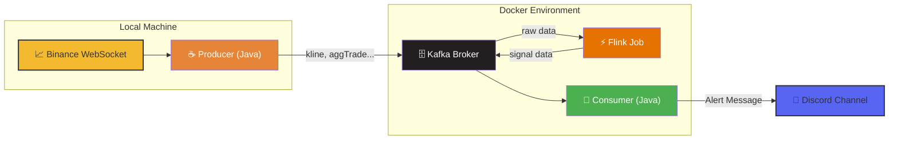

# Binance Real-time Alert System 
실시간 바이낸스 거래소의 거래 데이터를 수집, 특정 패턴(거래량 급증, 상승 모멘텀)을 감지하면 디스코드로 알림을 보내는 실시간 시그널 분석 시스템

**개발 Notion** : https://woojangpark.notion.site/Binance-Signal-Alert-26d722ad4a2080a68059d4a950aa17fa?source=copy_link


   
<br><br>

## ✨ Features

* **실시간 데이터 수집**: 바이낸스 WebSocket 스트림을 통해 kline, bookTicker, aggTrade 데이터를 실시간으로 수집합니다.
* **안정적인 데이터 파이프라인**: Apache Kafka를 메시지 큐로 사용하여 대용량 데이터를 안정적으로 처리합니다.
* **실시간 스트림 분석**: Apache Flink를 사용하여 거래량 급증, 상승 모멘텀과 같은 의미 있는 시그널을 실시간으로 분석합니다.
* **간편한 실행 환경**: Docker Compose를 사용하여 명령어 하나로 전체 시스템(Kafka, Flink, Consumer)을 실행할 수 있습니다.
* **실시간 알림**: 분석된 시그널은 Discord 웹훅을 통해 지정된 채널로 즉시 전송됩니다.

<br><br>
   

## 🛠️ Tech Stack
* **Language**: Java 17
* **Stream Processing**: Apache Flink
* **Message Queue**: Apache Kafka
* **Containerization**: Docker, Docker Compose

   
<br><br>
   

## ⚙️ Installation & Usage
프로젝트 실행은 Unix 기반 OS에서 가능합니다.
해당 프로젝트를 실행하기 위해서는 Docker와 Docker Desktop이 설치되어 있어야 합니다.

<br>

### 1. Project Clone
```bash
git clone https://github.com/pjw81226/binance-rise-alert.git
cd binance-rise-alert
```


### 2. Setting
실행을위해 알림을 받을 디스코드 채팅 채널의 웹훅 url을 생성해야합니다.   
(참고 : https://support.discord.com/hc/en-us/articles/228383668-Intro-to-Webhooks)


생성한 웹훅 URL을 복사합니다.
이 웹훅 URL은 **환경변수 `DISCORD_WEBHOOK_URL`** 로 설정합니다. (코드에 하드코딩하지 않습니다)

예시 (bash):

```bash
export DISCORD_WEBHOOK_URL="여기에_디스코드_웹훅_URL"
```


### 3. Execute Docker Container

프로젝트의 루트에서 아래 명령어를 사용하여 모든 서비스를 실행합니다. 최초 실행 시 이미지를 빌드하므로 시간이 다소 걸릴 수 있습니다.

```bash
docker compose up -d
``` 


### 4. Flink Job 제출

1.  웹 브라우저에서 Flink UI(`http://localhost:8081`)에 접속합니다.
2.  Flink UI의 'Submit New Job' 메뉴에서 'Add New' 버튼을 누르고 `jars/flink-job-1.0.0.jar` 파일을 선택합니다.
3.  제출된 job을 선택하고 Parallelism에 값을 넣고 'submit' 버튼을 누릅니다 (예: 3, 추적하는 심볼의 개수 혹은 그 이하로 설정하는 것이 좋음)


### 5. Producer 실행

바이낸스 데이터를 수집하여 Kafka로 전송하는 Producer를 실행합니다. 프로젝트 루트 디렉토리의 `run_producer.sh` 스크립트를 사용합니다.

```bash
# 프로젝트 루트 디렉토리에서 실행 권한 부여 (최초 한번)
chmod +x run_producer.sh

# 원하는 pair를 지정하여 Producer 실행 (예시 BTC/USDT, ETH/USDT, SOL/USDT)
./run_producer.sh btcusdt,ethusdt,solusdt
```


## 🏗️ Architecture




